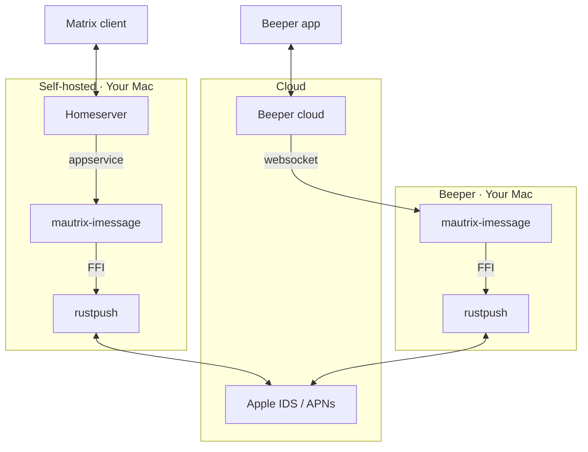

# mautrix-imessage

A Matrix-iMessage puppeting bridge. Send and receive iMessages from any Matrix client.

**Features**: text, images, video, audio, files, reactions/tapbacks, edits, unsends, typing indicators, read receipts, group chats, and contact name resolution.

## Quick Start

macOS 14.2+ required. Sign into iCloud on the Mac running the bridge (Settings → Apple ID) — this lets Apple recognize the device so login works without 2FA prompts.

### With Beeper

```bash
git clone https://github.com/lrhodin/imessage.git
cd imessage
make install-beeper
```

The installer handles everything: Homebrew, dependencies, building, Beeper login, config, and LaunchAgent setup. Once running, DM `@sh-imessagebot:beeper.local` in Beeper and send `login`.

### With a Self-Hosted Homeserver

```bash
git clone https://github.com/lrhodin/imessage.git
cd imessage
make install
```

The installer auto-installs Homebrew and dependencies if needed, asks three questions (homeserver URL, domain, your Matrix ID), generates config files, and starts the bridge as a LaunchAgent. It will pause and tell you exactly what to add to your `homeserver.yaml` to register the bridge.

Once running, DM `@imessagebot:yourdomain` in your Matrix client and send `login`.

### Login

Follow the prompts: Apple ID → password. If the Mac is signed into iCloud with the same Apple ID, login completes without 2FA.

> **Tip:** In a DM with the bot, commands don't need a prefix. In a regular room, use `!im login`, `!im help`, etc.

### SMS Forwarding

To bridge SMS (green bubble) messages, enable forwarding on your iPhone:

**Settings → Messages → Text Message Forwarding** → toggle on the bridge device.

### Chatting

Incoming iMessages automatically create Matrix rooms. If Full Disk Access is granted, existing conversations from Messages.app are also synced.

To start a **new** conversation:

```
resolve +15551234567
```

This creates a portal room. Messages you send there are delivered as iMessages.

## Management

```bash
# View logs
tail -f data/bridge.stdout.log

# Restart
launchctl stop com.lrhodin.mautrix-imessage

# Stop
launchctl unload ~/Library/LaunchAgents/com.lrhodin.mautrix-imessage.plist

# Remove
make uninstall
```

## Configuration

Config lives in `data/config.yaml` (generated during install). To reconfigure:

```bash
rm -rf data
make install    # or make install-beeper
```

Key options:

| Field | What it does |
|-------|-------------|
| `network.initial_sync_days` | How far back to look for chats on first login (default 365) |
| `backfill.max_initial_messages` | Max messages per backfill (default 10000) |
| `backfill.max_catchup_messages` | Max messages for catch-up after restart |
| `database.type` | `sqlite3-fk-wal` (default) or `postgres` |
| `encryption` | End-to-bridge encryption settings |
| `network.displayname_template` | Contact name format |

## Development

```bash
make build      # Build .app bundle
make rust       # Build Rust library only
make bindings   # Regenerate Go FFI bindings (needs uniffi-bindgen-go)
make clean      # Remove build artifacts
```

## How It Works

The bridge connects directly to Apple's iMessage servers using [rustpush](https://github.com/OpenBubbles/rustpush) with local NAC validation (no SIP bypass, no relay server). On macOS with Full Disk Access, it also reads `chat.db` for message history backfill and contact name resolution.



### Real-time and backfill

**Real-time messages** flow through Apple's push notification service (APNs) via rustpush and appear in Matrix immediately.

**Backfill** runs once on first login: the bridge reads the local macOS `chat.db` and creates portals for all chats with activity in the last `initial_sync_days` (default: 1 year, configurable). After that, everything is real-time only via rustpush.

### Source layout

```
cmd/mautrix-imessage/        # Entrypoint
pkg/connector/               # bridgev2 connector
  ├── client.go              #   send/receive/reactions/edits/typing
  │                          #   + periodic health check & backfill
  ├── login.go               #   Apple ID + 2FA login flow
  ├── chatdb.go              #   chat.db backfill + contacts (macOS)
  │                          #   + GUID set-diff for missing messages
  ├── ids.go                 #   identifier/portal ID conversion
  ├── connector.go           #   bridge lifecycle
  └── ...
pkg/rustpushgo/              # Rust FFI wrapper (uniffi)
nac-validation/              # Local NAC via AppleAccount.framework
rustpush/                    # OpenBubbles/rustpush (vendored)
imessage/                    # macOS chat.db + Contacts reader
```

## License

AGPL-3.0 — see [LICENSE](LICENSE).
